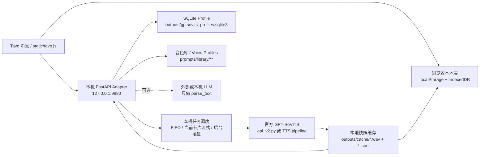

# Leon_api

`Leon_api/` 是本轮 GPT-SoVITS / Genie-TTS 验证工作区。

如果这是新 Codex 会话，请先读：

- `AGENTS.md`
- `handoff_docs/CURRENT_STATUS.md`
- `handoff_docs/NEXT_SESSION.md`
- `handoff_docs/EVALUATION_PLAN.md`
- `handoff_docs/DISTRIBUTION_PLAN.md`

目标不是迁移旧 IndexTTS2 项目，也不要求保留旧接口形状。当前方向是从零评估一套更专业、更稳定、更适合打包分发给社区用户本地运行的 TTS 产品。

重要定位：

- 不做公网服务器。
- 不开放远程 API。
- 产品优先以本地文件、整合包、脚本、模型和前端资源交付。
- Tavo.js 只是可分发产品的一部分，不是唯一交付物。
- HTTP API 如果存在，也只作为用户本机内部组件或调试入口。

## GPT-SoVITS × Tavo 本地交付目标

旧 IndexTTS2 × Tavo 后期已经形成的本地交付效果要迁移到 GPT-SoVITS 上，但不照搬 IndexTTS2 引擎实现。目标是保留用户体验和本机交付架构，底层换成官方 GPT-SoVITS 训练/推理能力。

必须达到的效果：

- Tavo 里只注入一个 `static/tavo.js`，用户点击消息卡片才触发解析、排队、生成或读缓存。
- 支持多角色多音色：旁白、用户、当前角色和额外角色都能映射到不同 GPT-SoVITS 音色 Profile。
- 支持流式或准流式播放：当前播放卡片优先流式；非当前卡片只后台生成并落盘，不抢正在播放的音频。
- 支持本地快照缓存：相同文本、角色、参考音频、权重和推理参数命中同一个 `cache_key`，生成后保存 WAV + JSON 元数据。
- 支持 Tavo 持久化配置：优先 `tavo.get` / `tavo.set`，浏览器 `localStorage` 只做回退。
- 支持浏览器离线音频：可选把已生成音频保存到 IndexedDB，断网或本地服务关闭后仍能播放历史卡片。
- 支持 SQLite 轻量 Profile：保存 Tavo 配置快照、角色映射、使用记录，不做用户账号和云端后台。
- 支持可选 LLM 拆段：OpenAI-compatible 直连或本机 `/parse_text` 代理，只负责文本切段/角色识别，不绑定 GPT。
- 支持诊断入口：至少能看到参数、任务状态、缓存状态、显存/内存、RTF、首包和输出路径。

GPT-SoVITS 里的“音色”不能只等同于一个 wav 文件，应该抽象成角色级 Voice Profile：

```json
{
  "name": "mika_whisper_v2proplus",
  "ref_audio_path": "prompts/library/mika/ref.wav",
  "prompt_text": "参考音频对应原文",
  "prompt_lang": "zh",
  "text_lang": "auto",
  "gpt_weights_path": "GPT_SoVITS/pretrained_models/s1v3.ckpt",
  "sovits_weights_path": "GPT_SoVITS/pretrained_models/v2Pro/s2Gv2ProPlus.pth",
  "default_params": {
    "batch_size": 1,
    "sample_steps": 32,
    "top_k": 15,
    "top_p": 1.0,
    "temperature": 1.0,
    "text_split_method": "cut5",
    "streaming_mode": 2,
    "parallel_infer": true,
    "speed_factor": 1.0,
    "fragment_interval": 0.3,
    "overlap_length": 2,
    "min_chunk_length": 16
  }
}
```

目标架构：



迁移原则：

- 复用旧 IndexTTS2 Tavo 前端的交互经验：播放卡片、歌词/字幕、角色映射、音色选择器、IndexedDB 离线音频、MediaSession、断点续播。
- 后端重新做 GPT-SoVITS adapter：不要把 IndexTTS2 的情绪向量、BigVGAN/vLLM 细节硬搬过来。
- 先保持旧前端需要的本地接口契约，再把接口内部接到官方 GPT-SoVITS。
- 所有迁移代码先放 `Leon_api/`，官方 `../gpt-sovits-official/` 保持干净。
- 先跑通官方推理，再做训练；ASMR 音色训练验证后置。

## 仓库布局

- `../gpt-sovits-official/`：官方 GPT-SoVITS，上游仓库 `RVC-Boss/GPT-SoVITS`
- `../genie-tts/`：Genie-TTS，上游仓库 `High-Logic/Genie-TTS`
- `handoff_docs/`：验证计划、当前状态、交接记录
- `dev_tools/`：本地验证脚本和小工具
- `samples/`：测试用文本、参考音频说明、角色配置样例
- `reports/`：基准测试结果和人工听感记录

## 当前原则

- 第三方源码目录先保持只读式使用，避免把本地实验改动混进上游项目。
- 所有本地验证脚本、记录和临时配置优先放在 `Leon_api/`。
- 资源和缓存优先放到 D 盘，避免复现 C 盘缓存爆炸问题。
- 验证重点按本地分发产品排序：稳定性、显存/内存、磁盘占用、启动体验、流式首包延迟、多音色切换、中文/日语质量、打包可维护性。
- 不以旧 IndexTTS2/TAVO 接口兼容为优先级；旧经验只作为风险参考。

## 当前候选

1. 官方 GPT-SoVITS
   - 适合做基准、训练、模型格式源头确认。
   - 重点验证官方 `api_v2.py` 的流式模式、多语言、多参考音频和权重切换成本。
   - 当前主线：先用官方 GPT-SoVITS 做训练/推理验证，尤其是 ASMR 音色。

2. Genie-TTS
   - 适合验证低资源推理、ONNX、本机 FastAPI/脚本入口和多角色预加载。
   - 重点验证 `/load_character`、`/set_reference_audio`、`/tts` 的多音色调度与真实首包延迟。
   - 当前状态：已做基础测试，作为后期轻量运行时候选，暂不作为训练主线。

## 固定文档入口

- `handoff_docs/CURRENT_STATUS.md`
- `handoff_docs/NEXT_SESSION.md`
- `handoff_docs/EVALUATION_PLAN.md`
- `handoff_docs/DISTRIBUTION_PLAN.md`
