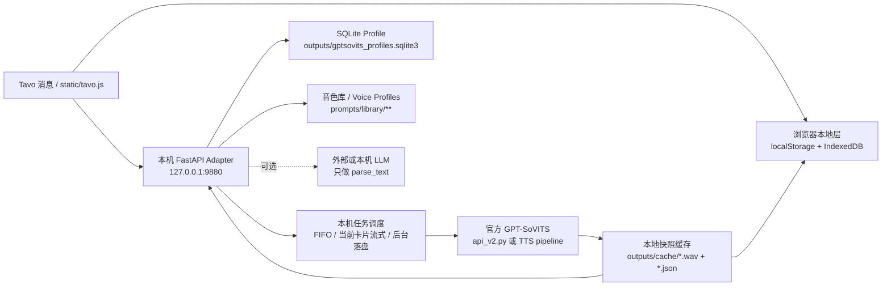

# Leon_api

`Leon_api/` 是本轮 GPT-SoVITS / Genie-TTS 验证工作区。

如果这是新 Codex 会话，请先读：

- `AGENTS.md`
- `handoff_docs/CURRENT_STATUS.md`
- `handoff_docs/NEXT_SESSION.md`
- `handoff_docs/EVALUATION_PLAN.md`
- `handoff_docs/DISTRIBUTION_PLAN.md`

目标不是迁移旧 IndexTTS2 项目，也不要求保留旧接口形状。当前方向是从零评估一套更专业、更稳定、更适合打包分发给社区用户本地运行的 TTS 产品。

重要定位：

- 不做公网服务器。
- 不开放远程 API。
- 产品优先以本地文件、整合包、脚本、模型和前端资源交付。
- Tavo.js 只是可分发产品的一部分，不是唯一交付物。
- HTTP API 如果存在，也只作为用户本机内部组件或调试入口。

## GPT-SoVITS × Tavo 本地交付目标

旧 IndexTTS2 × Tavo 后期已经形成的本地交付效果要迁移到 GPT-SoVITS 上，但不照搬 IndexTTS2 引擎实现。目标是保留用户体验和本机交付架构，底层换成官方 GPT-SoVITS 训练/推理能力。

必须达到的效果：

- Tavo 里只注入一个 `static/tavo.js`，用户点击消息卡片才触发解析、排队、生成或读缓存。
- 支持多角色多音色：旁白、用户、当前角色和额外角色都能映射到不同 GPT-SoVITS 音色 Profile。
- 支持流式或准流式播放：当前播放卡片优先流式；非当前卡片只后台生成并落盘，不抢正在播放的音频。
- 支持本地快照缓存：相同文本、角色、参考音频、权重和推理参数命中同一个 `cache_key`，生成后保存 WAV + JSON 元数据。
- 支持 Tavo 持久化配置：优先 `tavo.get` / `tavo.set`，浏览器 `localStorage` 只做回退。
- 支持浏览器离线音频：可选把已生成音频保存到 IndexedDB，断网或本地服务关闭后仍能播放历史卡片。
- 支持 SQLite 轻量 Profile：保存 Tavo 配置快照、角色映射、使用记录，不做用户账号和云端后台。
- 支持可选 LLM 拆段：OpenAI-compatible 直连或本机 `/parse_text` 代理，只负责文本切段/角色识别，不绑定 GPT。
- 支持诊断入口：至少能看到参数、任务状态、缓存状态、显存/内存、RTF、首包和输出路径。

GPT-SoVITS 里的“音色”不能只等同于一个 wav 文件，应该抽象成角色级 Voice Profile：

```json
{
  "name": "mika_whisper_v2proplus",
  "ref_audio_path": "prompts/library/mika/ref.wav",
  "prompt_text": "参考音频对应原文",
  "prompt_lang": "zh",
  "text_lang": "auto",
  "gpt_weights_path": "GPT_SoVITS/pretrained_models/s1v3.ckpt",
  "sovits_weights_path": "GPT_SoVITS/pretrained_models/v2Pro/s2Gv2ProPlus.pth",
  "default_params": {
    "batch_size": 1,
    "sample_steps": 32,
    "top_k": 15,
    "top_p": 1.0,
    "temperature": 1.0,
    "text_split_method": "cut5",
    "streaming_mode": 2,
    "parallel_infer": true,
    "speed_factor": 1.0,
    "fragment_interval": 0.3,
    "overlap_length": 2,
    "min_chunk_length": 16
  }
}
```

## GPT-SoVITS 三档使用模式

当前已经跑通的是第一档，不是训练模型。

1. Zero-shot 参考音频模式

   - 输入：一段约 5-10 秒参考音频 + 对应逐字稿 `prompt_text`。
   - 不训练 GPT/SoVITS 权重，直接用官方预训练模型推理。
   - 优点：最快，适合从旧音色库快速筛声音、跑 Tavo 交互、测流式首包和缓存链路。
   - 缺点：音色相似度、稳定性和情绪控制受参考音频质量与逐字稿准确度强影响；长文本、多情绪、ASMR 细节不一定稳。
   - 当前状态：已完成。`女声/高圆圆`、`女声/温柔御姐` 已按这个模式建 Voice Profile。

2. Few-shot 少量微调模式

   - 输入：同一说话人约 1-5 分钟干净素材，切片、ASR、校对后微调模型。
   - 官方 README 明确 few-shot 可用约 1 分钟训练数据提升相似度和真实感。
   - 优点：比 zero-shot 更像目标声音，短角色音色、常用角色、Tavo 高频角色应该优先走这一档。
   - 缺点：需要素材清洗、切片、逐字稿校对；每个角色会产生本地训练权重，分发包要管理版本和体积。
   - 计划用途：先选 1 个 ASMR 候选音色做最小微调实验，验证 12GB 显存、训练耗时、推理质量和权重切换成本。

3. Full / Character Model 完整角色模型模式

   - 输入：同一角色/说话人 20-40 分钟以上高质量素材，按训练集流程清洗、切片、ASR、人工校对。
   - 目标：沉淀可复用的角色级 GPT/SoVITS 权重，而不只是临时参考音频。
   - 优点：适合最终分发给社区用户的主力角色音色，稳定性、相似度和长文本表现应优于前两档。
   - 缺点：素材成本、训练时间、质检成本最高；ASMR 还要额外控制底噪、口水音、呼吸声、混响和爆音。
   - 计划用途：few-shot 验证通过后，再为核心 ASMR 音色做完整模型。

版本选择原则：

- v2：当前基准线，已跑通推理、流式、Tavo adapter 和真实音色 zero-shot。
- v2Pro / v2ProPlus：下一优先级。官方说明其硬件成本和速度接近 v2，效果可超过 v4，适合作为 12GB 显存机器上的 ASMR 主线候选。
- v3 / v4：更偏参考音频本身，对数据质量更敏感。官方说明平均质量数据集上 v1/v2/v2Pro 可能更稳，v3/v4 不一定适合低质量训练集。v4 仍需同素材实测后再决定是否作为主线。

阶段门槛：

- 不再用系统 TTS 参考音评估音质，只用旧音色库或真实素材。
- Zero-shot 阶段必须记录 `ref_audio_path`、`prompt_text`、首包、RTF、缓存路径和人工听感。
- Few-shot 前必须先有素材清单、切片结果、ASR 文本和校对状态。
- Full 模型前必须先有 20-40 分钟候选素材和可复现训练配置。

目标架构：



迁移原则：

- 复用旧 IndexTTS2 Tavo 前端的交互经验：播放卡片、歌词/字幕、角色映射、音色选择器、IndexedDB 离线音频、MediaSession、断点续播。
- 后端重新做 GPT-SoVITS adapter：不要把 IndexTTS2 的情绪向量、BigVGAN/vLLM 细节硬搬过来。
- 先保持旧前端需要的本地接口契约，再把接口内部接到官方 GPT-SoVITS。
- 所有迁移代码先放 `Leon_api/`，官方 `../gpt-sovits-official/` 保持干净。
- 先跑通官方推理，再做训练；ASMR 音色训练验证后置。

## 仓库布局

- `../gpt-sovits-official/`：官方 GPT-SoVITS，上游仓库 `RVC-Boss/GPT-SoVITS`
- `../genie-tts/`：Genie-TTS，上游仓库 `High-Logic/Genie-TTS`
- `handoff_docs/`：验证计划、当前状态、交接记录
- `dev_tools/`：本地验证脚本和小工具
- `samples/`：测试用文本、参考音频说明、角色配置样例
- `reports/`：基准测试结果和人工听感记录

## 当前原则

- 第三方源码目录先保持只读式使用，避免把本地实验改动混进上游项目。
- 所有本地验证脚本、记录和临时配置优先放在 `Leon_api/`。
- 资源和缓存优先放到 D 盘，避免复现 C 盘缓存爆炸问题。
- 验证重点按本地分发产品排序：稳定性、显存/内存、磁盘占用、启动体验、流式首包延迟、多音色切换、中文/日语质量、打包可维护性。
- 不以旧 IndexTTS2/TAVO 接口兼容为优先级；旧经验只作为风险参考。

## 当前候选

1. 官方 GPT-SoVITS
   - 适合做基准、训练、模型格式源头确认。
   - 重点验证官方 `api_v2.py` 的流式模式、多语言、多参考音频和权重切换成本。
   - 当前主线：先用官方 GPT-SoVITS 做训练/推理验证，尤其是 ASMR 音色。

2. Genie-TTS
   - 适合验证低资源推理、ONNX、本机 FastAPI/脚本入口和多角色预加载。
   - 重点验证 `/load_character`、`/set_reference_audio`、`/tts` 的多音色调度与真实首包延迟。
   - 当前状态：已做基础测试，作为后期轻量运行时候选，暂不作为训练主线。

## 固定文档入口

- `handoff_docs/CURRENT_STATUS.md`
- `handoff_docs/NEXT_SESSION.md`
- `handoff_docs/EVALUATION_PLAN.md`
- `handoff_docs/DISTRIBUTION_PLAN.md`

## 2026-05-31 Current Execution Plan

Immediate task: download and validate the next official GPT-SoVITS model sets through proxy `127.0.0.1:7897`.

Status: completed. The 3-run-per-version zero-shot comparison is recorded at `D:\apiWorkSpace\GPT-SoVITS\Leon_api\reports\version_compare_20260531\REPORT.md`, with notes at `D:\apiWorkSpace\GPT-SoVITS\Leon_api\reports\version_compare_20260531\NOTES.md`.

Download targets:

- v2 baseline resources are already present and runnable.
- v2ProPlus needs `GPT_SoVITS/pretrained_models/s1v3.ckpt` and `GPT_SoVITS/pretrained_models/v2Pro/s2Gv2ProPlus.pth`.
- v4 needs `GPT_SoVITS/pretrained_models/s1v3.ckpt` and `GPT_SoVITS/pretrained_models/gsv-v4-pretrained/s2Gv4.pth`.
- Shared resources remain under `D:\apiWorkSpace\GPT-SoVITS\gpt-sovits-official\GPT_SoVITS\pretrained_models`.

After download, run the same zero-shot benchmark matrix for v2, v2ProPlus, and v4:

- Chinese short text.
- Chinese long text.
- Japanese short text.
- Chinese/Japanese mixed text.
- Multi-role dialogue through the local Tavo adapter.

Every run must record these fields with full absolute paths:

- model version and exact weight paths.
- prompt audio path and prompt text.
- inference parameters: `batch_size`, `sample_steps`, `top_k`, `top_p`, `temperature`, `text_split_method`, `streaming_mode`, `parallel_infer`, `speed_factor`, `fragment_interval`, `overlap_length`, `min_chunk_length`.
- first byte / first chunk time.
- total generation time.
- output audio duration and RTF.
- GPU memory before/after/peak when available.
- CPU Working Set / Private / Peak Working Set when available.
- output WAV and JSON metadata full paths.

Do not start few-shot training until v2ProPlus and v4 have both been downloaded and compared on the same zero-shot test set.

## 2026-05-31 V4 Parameter Retest

V4 is not deprecated. The earlier slow result was from `batch_size=1` and `sample_steps=32`, which is a conservative API default but not the best V4 product setting.

New V4 parameter sweep:

- Report: `D:\apiWorkSpace\GPT-SoVITS\Leon_api\reports\v4_param_sweep_20260531\REPORT.md`
- Raw data: `D:\apiWorkSpace\GPT-SoVITS\Leon_api\reports\v4_param_sweep_20260531\result.json`
- Script: `D:\apiWorkSpace\GPT-SoVITS\Leon_api\dev_tools\bench_gptsovits_v4_params.py`

Key results on the long multi-sentence test:

| Case | batch_size | sample_steps | parallel_infer | First byte | RTF | GPU after |
| --- | ---: | ---: | --- | ---: | ---: | ---: |
| old baseline | 1 | 32 | true | 26.407s | 0.951 | 4607 MiB |
| balanced fast | 8 | 8 | true | 5.287s | 0.191 | 4598 MiB |
| quality-safer | 4 | 16 | true | 8.368s | 0.292 | 4596 MiB |
| fastest measured | 4 | 4 | true | 5.096s | 0.186 | 4596 MiB |

Current recommendation:

- Keep V4 as a real candidate, especially when the user prefers its stronger cadence and emotional contour.
- Use `batch_size=8`, `sample_steps=8`, `parallel_infer=true` as the first V4 speed/quality candidate for multi-sentence non-streaming generation.
- Keep `batch_size=4`, `sample_steps=16`, `parallel_infer=true` as the safer quality comparison candidate.
- Treat `sample_steps=4` as an extreme speed candidate that needs human listening before product default use.
- `batch_size` only helps when text is split into multiple fragments; it will not meaningfully speed up a single short sentence.

V4 output remains 48 kHz mono 16-bit PCM WAV, about 768 kbps. This is why V4 WAV files show higher Hz/kbps than v2/v2ProPlus; it is output format, not a separate step parameter.

## v2ProPlus + V4 Dual-Track Strategy

v2ProPlus and V4 can both be supported. This should be treated as a profile/runtime preset problem, not as two separate products.

Recommended split:

- v2ProPlus: stable default candidate for general dialogue, ASMR baseline, and community package first-run experience.
- V4: emotional/cadence candidate when the target voice benefits from stronger prosody, especially after the `batch_size=8` / `sample_steps=8` retest.

Implementation requirements:

- Every Voice Profile must record model version or exact weight paths.
- Cache keys must include model version, GPT weights, SoVITS weights, reference audio hash, prompt text, text, and inference parameters.
- Tavo/front-end UI should expose this as a model preset per voice, not as a global hidden switch.
- Short-term validation can use one official API process and call `/set_gpt_weights` + `/set_sovits_weights`.
- Product packaging should consider two local engine processes if users frequently mix v2ProPlus and V4 in one session, for example:
  - `127.0.0.1:9881`: v2ProPlus
  - `127.0.0.1:9882`: V4

Tradeoff:

- Single process is simpler and uses less idle VRAM, but model switching adds latency.
- Dual process is smoother for mixed-role playback, but uses more VRAM/RAM and needs clearer startup scripts.
- Dual process should not mean unlimited concurrent generation on a 12GB GPU. Idle CPU should be low, but VRAM is resident; queueing should limit active generation to avoid v2ProPlus and V4 peaking at the same time.

## 2026-05-31 AD学姐 V4 Voice Test

Created AD学姐 zero-shot Voice Profile:

- Profile: `D:\apiWorkSpace\GPT-SoVITS\Leon_api\prompts\library\女声\AD学姐.json`
- Reference audio: `D:\apiWorkSpace\GPT-SoVITS\Leon_api\prompts\library\女声\AD学姐.wav`
- Reference duration: about 6.74s, mono, 22050 Hz source WAV.
- Prompt text is an ASR-assisted first pass and still needs human correction.

AD学姐 V4 report:

- Report: `D:\apiWorkSpace\GPT-SoVITS\Leon_api\reports\v4_ad_xuejie_20260531\REPORT.md`
- Raw data: `D:\apiWorkSpace\GPT-SoVITS\Leon_api\reports\v4_ad_xuejie_20260531\result.json`
- Local WAV outputs are in `D:\apiWorkSpace\GPT-SoVITS\Leon_api\reports\v4_ad_xuejie_20260531\**\run_*.wav` and are ignored by git.

AD学姐 3-run averages:

| Case | batch_size | sample_steps | First byte | RTF | GPU after |
| --- | ---: | ---: | ---: | ---: | ---: |
| recommended fast | 8 | 8 | 2.480s | 0.163 | 4744 MiB |
| fastest-step candidate | 4 | 4 | 2.992s | 0.198 | 4745 MiB |
| quality-safer candidate | 4 | 16 | 4.882s | 0.311 | 4745 MiB |
